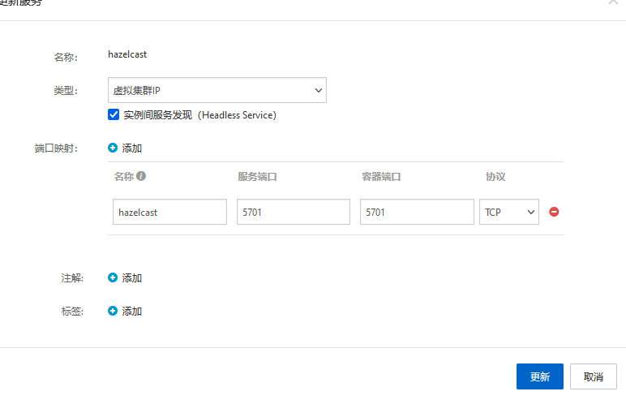

## 简介

https://docs.hazelcast.com

## 依赖

```
    <!--CACHE-->
    <dependency>
        <groupId>org.springframework.boot</groupId>
        <artifactId>spring-boot-starter-cache</artifactId>
    </dependency>
    <dependency>
        <groupId>com.hazelcast</groupId>
        <artifactId>hazelcast-spring</artifactId>
        <version>5.3.6</version>
    </dependency>
    <!--CACHE-->
```

## k8s集群配置

需要配置k8s的Service


```yaml
demo:
  cache:
    hazelcast:
      enable: true
      cluster: false
      dns: hazelcast.aed-test.svc.cluster.local # k8s 集群配置需要这个dns,且容器需要暴露5701 tcp端口
spring:
  cache:
    type: hazelcast
```

```java

@Configuration
@ConditionalOnProperty(prefix = "demo.cache.hazelcast", name = "enabled", havingValue = "true", matchIfMissing = true)
@RequiredArgsConstructor
public class CacheConfig {
    private final SpringContextUtil springContextUtil;
    @Value("${demo.cache.hazelcast.cluster:true}")
    private Boolean cluster;
    @Value("${demo.cache.hazelcast.dns}")
    private String dns;

    @Bean
    @ConditionalOnMissingBean//缓存管理器的自定义器
    public CacheManagerCustomizers cacheManagerCustomizers(ObjectProvider<CacheManagerCustomizer<?>> customizers) {
        return new CacheManagerCustomizers(customizers.orderedStream().collect(Collectors.toList()));
    }

    @Bean
    HazelcastCacheManager cacheManager(CacheManagerCustomizers customizers) {
        HazelcastCacheManager cacheManager = new HazelcastCacheManager(hazelcastInstance(config()));
        return customizers.customize(cacheManager);
    }


    @Bean
    @SneakyThrows
    public Config config() {
        Config config = new Config();
        config.setClusterName("demo_cache");
        String profile = SpringContextUtil.getProfile();
        if (Objects.equals(profile, "dev")) {
            config.setNetworkConfig(new NetworkConfig().setJoin(new JoinConfig().setAutoDetectionConfig(new AutoDetectionConfig().setEnabled(false))));
        }
        if (!Objects.equals(profile, "dev") && Objects.equals(cluster, true)) {
            NetworkConfig networkConfig = new NetworkConfig();
            networkConfig.setJoin(new JoinConfig().setMulticastConfig(new MulticastConfig().setEnabled(false)));
            config.getNetworkConfig().getJoin().getKubernetesConfig().setEnabled(true)
                    .setProperty("service-dns", dns);
        }
        Set<Class<?>> annotatedClasses = AnnotationUtil.findAnnotatedClasses("com.demo", MyCache.class);
        for (Class<?> annotatedClass : annotatedClasses) {
            Field[] declaredFields = annotatedClass.getDeclaredFields();
            for (Field declaredField : declaredFields) {
                declaredField.setAccessible(true);
                MyCache annotation = declaredField.getAnnotation(MyCache.class);
                String value = (String) declaredField.get(null);
                config.addMapConfig(new MapConfig().setName(value).setTimeToLiveSeconds(annotation.liveSeconds()));
            }
        }
        return config;
    }

    @Bean("myHazelcastInstance")
    public HazelcastInstance hazelcastInstance(Config config) {
        HazelcastInstance hazelcastInstance = Hazelcast.newHazelcastInstance(config);
        //发布/订阅模式
        ITopic<String> topic = hazelcastInstance.getTopic("HAZELCAST_TOPIC");
        // 新增topic的监听者，具体实现加后文
        topic.addMessageListener(new TopicListener());
        return hazelcastInstance;
    }

}


```

```java

@Slf4j
@Component
public class TopicListener implements MessageListener<String> {

    @Override
    public void onMessage(Message<String> message) {
        Object msg = message.getMessageObject();
        log.info("订阅者，收到Topic消息：{}", msg);
    }
}


```
